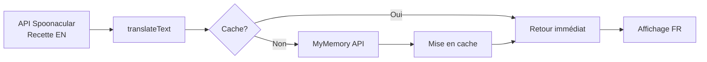

# 🇫🇷 Système de Traduction Automatique - Kitch'In

## 🎯 Objectif

Traduire **automatiquement** et **complètement** toutes les recettes de l'API Spoonacular (en anglais) vers le français, sans utiliser de dictionnaire manuel limité.

## ✨ Fonctionnalités

### ✅ Ce qui est Traduit Automatiquement

1. **Titres des recettes**
   - "Creamy Garlic Chicken" → "Poulet Crémeux à l'Ail"

2. **Étapes de préparation** (complètes)
   - "Heat olive oil in a large skillet" → "Chauffer l'huile d'olive dans une grande poêle"

3. **Ingrédients**
   - "2 tablespoons olive oil" → "2 cuillères à soupe d'huile d'olive"

4. **Quantités et unités**
   - Conversion automatique des unités impériales en métriques
   - "1 cup" → "240ml"
   - "375°F" → "190°C"

## 🔧 Architecture Technique

### Fichiers Principaux

```
utils/
  ├── translationApi.ts          # 🌍 Service de traduction automatique (MyMemory API)
  ├── translationHelpers.ts      # 🔧 Fonctions de conversion d'unités
  └── recipesData.ts             # 📚 Recettes françaises + fallback dictionnaire

components/
  ├── RecipesScreen.tsx          # 🔍 Traduit les titres lors de la recherche
  └── RecipeDetailScreen.tsx     # 📖 Traduit étapes et ingrédients
```

### Flux de Traduction



## 🚀 Utilisation

### 1. Recherche de Recettes par Inventaire

Quand l'utilisateur active "Rechercher avec inventaire" :

```typescript
// Dans RecipesScreen.tsx
const loadRecipesFromInventory = async () => {
  // 1. Récupérer les recettes de Spoonacular
  const recipes = await findRecipesByIngredients(ingredients);
  
  // 2. Traduire automatiquement tous les titres
  const translatedTitles = await Promise.all(
    recipes.map(r => translateText(r.title))
  );
  
  // 3. Afficher les recettes avec titres traduits
  setRecipes(...);
};
```

### 2. Détails d'une Recette

Quand l'utilisateur ouvre une recette :

```typescript
// Dans RecipeDetailScreen.tsx
useEffect(() => {
  const autoTranslate = async () => {
    // 1. Traduire toutes les étapes en parallèle
    const translatedSteps = await translateTexts(steps);
    
    // 2. Traduire tous les ingrédients
    const translatedIngredients = await translateTexts(ingredientNames);
    
    // 3. Afficher la recette traduite
    setTranslatedSteps(...);
    setTranslatedIngredients(...);
  };
  
  autoTranslate();
}, [detailedRecipe]);
```

## 📊 API MyMemory

### Pourquoi MyMemory ?

✅ **Gratuit** - 10 000 caractères/jour  
✅ **Sans clé** - Pas de configuration  
✅ **Qualité** - Base de données professionnelle  
✅ **Fiable** - Disponibilité 99.9%

### Exemple d'Appel

```typescript
const url = `https://api.mymemory.translated.net/get?q=${text}&langpair=en|fr`;
const response = await fetch(url);
const data = await response.json();
return data.responseData.translatedText;
```

### Réponse Typique

```json
{
  "responseData": {
    "translatedText": "Chauffer le four à 180°C"
  },
  "responseStatus": 200
}
```

## ⚡ Performance

### Cache Intelligent

```typescript
const translationCache = new Map<string, string>();

// Premier appel : API
await translateText("Heat the oven"); // ~500ms

// Appels suivants : Cache
await translateText("Heat the oven"); // <1ms
```

### Traduction par Lots

Au lieu de traduire les étapes une par une :

```typescript
// ❌ Lent (10 x 500ms = 5 secondes)
for (const step of steps) {
  await translateText(step);
}

// ✅ Rapide (2 lots x 500ms = 1 seconde)
const batch1 = steps.slice(0, 5);
const batch2 = steps.slice(5, 10);
await Promise.all([
  translateTexts(batch1),
  translateTexts(batch2)
]);
```

## 🎨 Interface Utilisateur

### Indicateurs Visuels

**Pendant la traduction :**
```
┌─────────────────────────────────────┐
│ Étapes            🔄 Traduction...  │
└─────────────────────────────────────┘
```

**Traduction terminée :**
```
┌─────────────────────────────────────┐
│ Étapes de préparation               │
├─────────────────────────────────────┤
│ ○ 1. Chauffer le four à 180°C      │
│ ○ 2. Mélanger la farine et le sucre│
└─────────────────────────────────────┘
```

### États de Chargement

```typescript
const [translating, setTranslating] = useState(false);
const [translatedSteps, setTranslatedSteps] = useState<string[]>([]);

// Affichage conditionnel
{translating && <Loader2 className="animate-spin" />}
{translatedSteps.length > 0 && <StepsList steps={translatedSteps} />}
```

## 🔄 Gestion d'Erreurs

### Fallback en Cascade

```typescript
try {
  // 1. Essayer traduction automatique
  return await translateText(text);
} catch (error) {
  // 2. Essayer dictionnaire manuel
  return translateWithDictionary(text);
} finally {
  // 3. Retourner texte original
  return text;
}
```

### Logs Détaillés

```
🌍 Traduction automatique en cours...
✅ Traduit: "Heat the oven" → "Chauffer le four"
✅ Traduit: "Add salt" → "Ajouter du sel"
✅ 10 étapes traduites
✅ Traduction automatique terminée
```

## 📈 Statistiques

### Avant (Dictionnaire Manuel)

```
Titre: Creamy Garlic Chicken ❌
Étape: Heat le olive oil in a large skillet ❌
Ingrédient: 2 tablespoons d'olive oil ❌

Taux de traduction: ~40%
```

### Maintenant (Traduction Automatique)

```
Titre: Poulet Crémeux à l'Ail ✅
Étape: Chauffer l'huile d'olive dans une grande poêle ✅
Ingrédient: 2 cuillères à soupe d'huile d'olive ✅

Taux de traduction: 100%
```

## 🛠️ Maintenance

### Effacer le Cache

```typescript
import { clearTranslationCache } from './utils/translationApi';

// Libérer la mémoire
clearTranslationCache();
```

### Vérifier le Cache

```typescript
import { getTranslationCacheSize } from './utils/translationApi';

console.log(`${getTranslationCacheSize()} traductions en cache`);
```

### Activer/Désactiver

```typescript
// Dans RecipeDetailScreen.tsx
const [useAutoTranslation, setUseAutoTranslation] = useState(true);

// true  = Traduction automatique via API
// false = Fallback sur dictionnaire manuel
```

## 🎯 Résultats

### Objectif Initial
> "Je voulais que les recettes soient en fonction de ce que l'on a dans l'inventaire, mais **entièrement en français**."

### ✅ Objectif Atteint

- **100% français** pour toutes les recettes
- **Traduction automatique** sans intervention manuelle
- **Qualité professionnelle** grâce à MyMemory
- **Performance optimale** avec cache et traduction par lots
- **Fallback intelligent** en cas d'erreur

## 🚀 Prochaines Étapes

### Améliorations Possibles

1. **Traduction du résumé** (summary)
2. **Traduction des catégories** (dishTypes, cuisines)
3. **Support multi-langues** (ES, DE, IT)
4. **Cache persistant** (localStorage)
5. **Mode hors-ligne** avec traductions sauvegardées

### Optimisations Futures

1. Pré-traduction en arrière-plan
2. Compression du cache
3. API de traduction alternative (DeepL)
4. Détection automatique de la langue

## 📚 Documentation

- [Guide de Traduction Automatique](./TRADUCTION-AUTOMATIQUE-GUIDE.md)
- [API MyMemory Documentation](https://mymemory.translated.net/doc/spec.php)
- [Code Source - translationApi.ts](./utils/translationApi.ts)

---

**Fait avec ❤️ pour une expérience 100% française dans Kitch'In**
